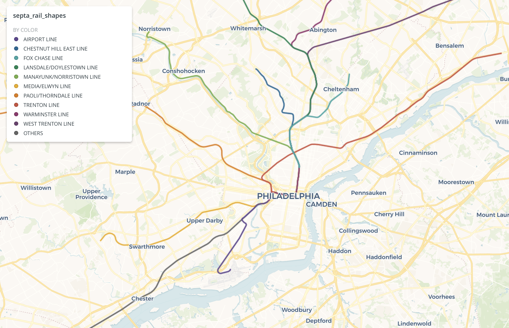

# Lab 4 - PostGIS with GTFS data

We'll continue to use the Septa GTFS data from [Tuesday's Lecture](README.md#Lecture), this time focusing on the rail data. Let's dig into the data a bit more by looking at some of the files.

First, import the data into your Carto account.
* Septa GTFS data: `https://github.com/MUSA-509/week-4-spatial-joins-and-indexes/blob/master/data/septa_gtfs_rail.zip?raw=true`
* OSM buildings for Philadelphia: `https://raw.githubusercontent.com/MUSA-509/week-4-spatial-joins-and-indexes/master/data/philadelphia_osm_buildings.geojson`

**Files** -- I've renamed them to be `septa_gtfs_x`, but GTFS come with standardized names.
* [`shapes.txt`](https://gtfs.org/reference/static/#shapestxt) - geospatial 'shape' of a full trip on any route as a collection of ordered lat/long pairs
  - `shape_id` - unique ID referencing the shape traced out by connecting all points with the same ID ordered by `shape_pt_sequence`. Note: multiple `shape_id`s correspond to a `route_id`. E.g., there may be the same train line but rush-hour service, express service, weekend service, etc.
  - `shape_pt_lat` - latitude of point part of shape
  - `shape_pt_lon` - longitude of point part of shape
* [`trips.txt`](https://gtfs.org/reference/static/#tripstxt)
  - `route_id` - ID of a route
  - `shape_id` - Allows us to associate shapes with routes
* [`routes.txt`](https://gtfs.org/reference/static/#routestxt)
  - `route_id` - unique ID for a route
  - `route_short_name` - short name of the route (e.g., `Green`, `L`, etc.)

## 1. Add geometries to tables

1. `septa_rail_stops`
2. `septa_rail_shapes` -- NOTE, only do UPDATEs for ranges of `cartodb_id`. E.g., add `WHERE cartodb_id between 1 and 40000`, between 40000 and 80000, and 80000 and 102000 (max is a bit over 101k). Otherwise, the operation will timeout due to query limits on Carto's platform. See [note](#Indexes) on building an index on `geography` types.

```SQL
-- add your query here
```

## 2. Create rail routes

Use the `shapes.txt` table, grouping by appropriate fields. Make sure there is an ORDER BY in the [`ST_MakeLine`](https://postgis.net/docs/ST_MakeLine.html) too.

```SQL
-- add your query here
```

**Note**

To visualize the data, make sure to add `the_geom_webmercator` and `cartodb_id` in the `SELECT` clause. You can probably put your query in the subquery here:

```SQL
SELECT *, ST_Transform(the_geom, 3857) as the_geom_webmercator, row_number() over () as cartodb_id
FROM (
  -- put your query here
) as _w
```

## 3. Find the length of each shape in meters

Use the query from the previous result and add a new expression to calculate the length of the shapes/routes.

```SQL
-- put your query here
```

## 4. Find the number of buildings nearby

For each stop, find the number of buildings in Philadelphia county within 800 meters (use 0.008 as an approximation to avoid casting to geography which can lead to DB timeouts).

**Note:** Make sure to account for cases where there are no buildings (i.e., outside Philadelphia county).

```SQL
-- put your query here
```

## 5. Create a crosswalk table

Create a virtual table (a query) that pairs a `shape_id` with a `route_id`. Build it from the `septa_rail_trips` table. We'll use this later to JOIN with information in other tables.

To keep things simple, let's only pair one `shape_id` with one `route_id`. Use the [`DISTINCT ON()`](https://www.postgresql.org/docs/12/sql-select.html#SQL-DISTINCT) to select only one `shape_id` per `route_id`.

For example, if we had a table like this, `scores`:

```
  name  | score
--------|-------
Banksy  |   5
Andy    |   3
Frannie |   7
Andy    |   4
Frannie |   9
```

We could select the top or bottom scores using `DISTINCT ON` with an `ORDER BY`. Here we get the top scores:

```
SELECT DISTINCT ON(name) name, score
FROM scores
ORDER BY name, score DESC;
```

Apply this to create a query for `shape_id` and `route_id` only from the `septa_rail_trips` table.

```SQL
-- put your query here
```

### 6. Do a sanity check on the previous query.

Using a `GROUP BY`, wrap the previous query as a subquery to make sure there is only one `shape_id` per `route_id`

```SQL
SELECT route_id, COUNT(shape_id)
FROM (
  -- your query from above
) as _w
GROUP BY 1
```

If you wrote the query correctly, `COUNT` should be `1` for each row.

## 7. Now create a rail map




1. Use the query from \#2
2. Join it with the query from \#3
3. Join it again with `septa_rail_routes` table to get the `route_short_name`

Yes, you can have more than one join!

```SQL
SELECT ...
FROM tablea
JOIN tableb
ON ST_Intersects(tablea.geom, tableb.geom)
JOIN tablec
ON tablec.id = tablea.id
```

In the `SELECT`, make sure to have:

1. Linestring of the routes (geometry)
2. `shape_id`
3. `route_id`
4. `route_short_name`

```SQL
-- write your query here
```

## Indexes

You can create indexes for using geography types. For example, the query for finding the number of buildings within 800 meters, we use two tables. Add a geography index to each to get potential speedups for query results.

```SQL
CREATE INDEX septa_rail_stops_geography_idx ON  andyepenn.septa_rail_stops USING GIST(geography(the_geom));
CREATE INDEX philadelphia_osm_buildings_geography_idx ON  andyepenn.philadelphia_osm_buildings USING GIST(geography(the_geom))
```
